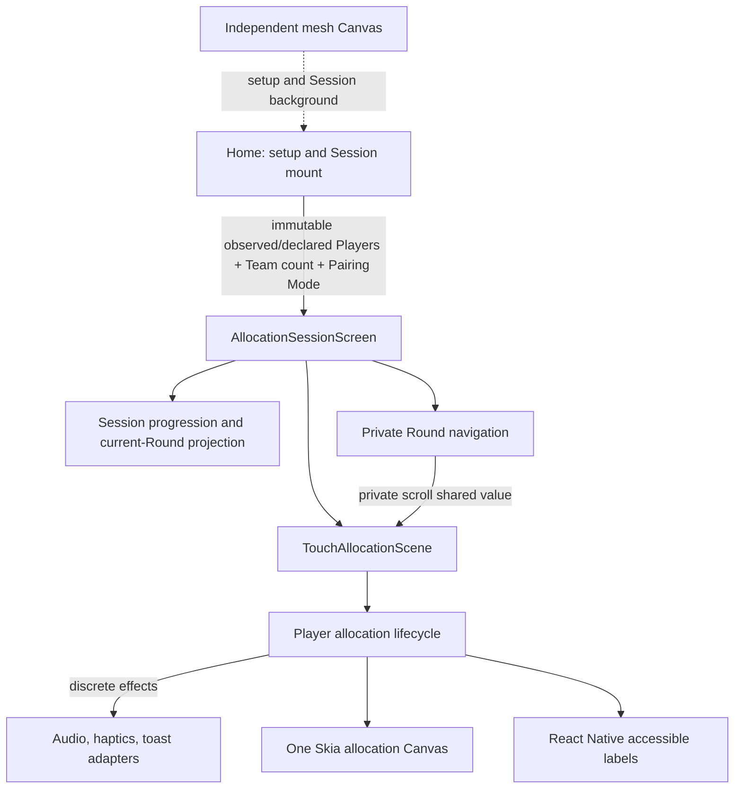

# Allocation architecture

This document replaces the temporary architecture HTML generated on 16 August 2026 and reconciles the Shopify examples, the Medium article, the third-party Reanimated/Skia performance skill, and the architecture review against the implementation on this branch.

## Current structure

`Home` owns only the platform-specific setup policy, editable setup values, and whether an active Session is visible. Android hides Player selection and always snapshots an Observed Player Count. On iOS and web, the visual `More players: 5+` entry still snapshots an Observed Player Count when left unchanged; pressing plus selects a Declared Player Count from 6 to 10. Team count appears first and remains part of the same immutable configuration as Player selection and Pairing Mode. The Session's external interface remains `configuration` plus `onExit`; Fair Allocation planning, snapshots, reset keys, touch state, Round mechanics, controls, and the pointer-safe exit handshake are private implementation details.

An observed Android Round accepts the contacts actually reported by the device, from the selected Team count through the application's twelve-slot ceiling. The three-second stability countdown restarts whenever that observed count changes. Hardware may report fewer simultaneous contacts than the application supports; a thirteenth reported contact is ignored with localized capacity feedback. Planned iOS/web Rounds remain limited to five Players each.

## Reconciled feedback matrix

The source names below preserve the grouping used by the original review, not
literal authorship of every app-specific decision. The detailed provenance
audit in [`feedback-source-audit.md`](./feedback-source-audit.md) distinguishes
direct source guidance, project adaptations, and independent architecture
review decisions.

| Origin and applied decision                                          | Result                                         | Implementation or reason                                                                                                                                                                                 |
| -------------------------------------------------------------------- | ---------------------------------------------- | -------------------------------------------------------------------------------------------------------------------------------------------------------------------------------------------------------- |
| Shopify examples (adapted): one Canvas for live and revealed artwork | Implemented                                    | Twelve possible live slots and both Round snapshots share one allocation Canvas and one shimmer clock. Expensive revealed artwork mounts only for assigned slots; the independent mesh remains separate. |
| Shopify examples: continuous values on the UI thread                 | Implemented                                    | Position, visibility, scale, countdown, reveal, shake, and scroll transforms use shared values/worklets.                                                                                                 |
| Shopify examples: semantic JavaScript crossings                      | Implemented                                    | JavaScript receives discrete count, reveal, swipe-hint, navigation-settled, feedback, and exit-ready events; drag lifecycle and scrolling remain on the UI thread.                                       |
| Shopify examples: deterministic reducer and injected planning        | Implemented                                    | Multi-Round planning occurs once when the immutable Session configuration is mounted; deterministic tests inject the random source.                                                                      |
| Shopify examples: a deeper allocation module                         | Implemented                                    | The active flow is behind `AllocationSessionScreen`; production and deterministic fake-clock tests use the same token-bearing transition and lifecycle-effect seam.                                      |
| Shopify examples: visual regression                                  | Implemented                                    | Five deterministic baselines assert one Canvas; additional assertions cover both settled accessibility projections and duplicate-label absence.                                                          |
| Medium: hybrid React Native/Skia screen                              | Implemented                                    | React Native owns controls, navigation, instructions, and accessibility; Skia owns artwork. ADR 0003 remains authoritative for this seam.                                                                |
| Medium: use a frame callback only for continuous work                | Implemented                                    | Allocation remains event-driven. Only the continuously animated mesh uses a pausable frame callback.                                                                                                     |
| Medium: keep semantic Session state in React/reducer                 | Implemented                                    | The Session reducer owns declared count, plans, Round state, and Revealed Players.                                                                                                                       |
| Medium: preserve accessibility outside Skia                          | Implemented                                    | Localized React Native labels expose only the current Round result set; decorative Skia artwork is not accessible.                                                                                       |
| Third-party skill: transforms instead of animated layout             | Implemented                                    | Allocation artwork uses Skia transforms rather than animated `left`, `top`, `width`, or `height`.                                                                                                        |
| Third-party skill: one UI-thread snapshot and atomic assignment      | Implemented                                    | Countdown completion creates one ordered snapshot; JavaScript allocates Teams; one scheduled UI worklet applies every Team/progress cell before the semantic reveal.                                     |
| Third-party skill: preserve Android pointer cleanup                  | Implemented in code; device validation pending | The manual gesture remains mounted, gates only new admissions, and always handles up/cancel. Exit waits for every tracked pointer.                                                                       |
| Third-party skill: preallocated mesh buffers                         | Rejected after experiment                      | Skia's supported `Vertices` interface uses `Point[]` and color arrays. Buffer-backed inputs rendered no mesh on tested builds, so the supported path was restored.                                       |
| Third-party skill: no per-frame mesh allocation                      | Not claimed                                    | The application recreates point arrays, point objects, color arrays, and color strings in derived values. The benchmark isolates observed cost instead of claiming zero allocation.                      |
| Third-party skill: measure full-screen blur                          | Fixture implemented; device evidence pending   | Environment-gated routes compare the unchanged mesh with blur, the identical overscanned mesh without blur, and a paused clock.                                                                          |
| Third-party skill: `.get()`/`.set()` consistency                     | Implemented in scope                           | Allocation Session, Round navigation, scene/controller, feedback animation, and mesh code use compiler-facing accessors where supported. Unrelated modules are deferred.                                 |

## Implementation references

- React effects follow the official `useEffect` setup/cleanup and dependency guidance: <https://react.dev/reference/react/useEffect>.
- Shared values use the React Compiler-compatible accessors documented by Reanimated: <https://docs.swmansion.com/react-native-reanimated/docs/core/useSharedValue/>.
- Round drag and momentum phases follow React Native's `ScrollView` event model: <https://reactnative.dev/docs/scrollview>.
- The permanently mounted manual gesture follows Gesture Handler's UI-thread lifecycle model: <https://docs.swmansion.com/react-native-gesture-handler/docs/fundamentals/state-manager/>.
- Deterministic scheduling tests use Vitest's documented fake-timer controls: <https://vitest.dev/guide/mocking/timers>.

## Architecture-review candidates

| Candidate from the temporary review | Resolution                                                                                                                                                                                                                                                          |
| ----------------------------------- | ------------------------------------------------------------------------------------------------------------------------------------------------------------------------------------------------------------------------------------------------------------------- |
| Deepen Player allocation lifecycle  | Implemented. One transition owns admission, identity, visibility/count policy, tokens, snapshots, reset/cancel, and deferred exit. Reanimated cells/effects are the production adapters; in-memory cells, a fake clock, and recorded effects are the test adapters. |
| Deepen Session progression          | Implemented. Session rules and current-Round projection moved out of `Home`.                                                                                                                                                                                        |
| Deepen Revealed Player presentation | Retained from PR #2. Live/frozen artwork and React Native labels use the shared scene projection, with settled-Round accessibility tests.                                                                                                                           |
| Deepen Round navigation             | Implemented. Offset, threshold, reset, arrows, pagination, drag/momentum settlement, and gating are private to the Session; only threshold and settlement cross to JavaScript.                                                                                      |

## Mesh benchmark protocol

Build with `EXPO_PUBLIC_ENABLE_NATIVE_PERF_FIXTURES=true` and open one fixed route at a time:

- `/__performance__/mesh?scenario=current`
- `/__performance__/mesh?scenario=no-blur`
- `/__performance__/mesh?scenario=paused`

The no-blur scenario retains the production 28-point overscan so blur is the only mesh parameter changed. Warm up for five seconds, record for 30 seconds, and capture the device model, OS, build type, frame behavior, hitches, and CPU/GPU observations. Use Instruments on iOS and `adb shell dumpsys gfxinfo <package> reset` followed by `adb shell dumpsys gfxinfo <package>` on Android.

## Evidence status

| Evidence                                                               | Status                                                                                                                                                                                                                                                                                      |
| ---------------------------------------------------------------------- | ------------------------------------------------------------------------------------------------------------------------------------------------------------------------------------------------------------------------------------------------------------------------------------------- |
| TypeScript, lint, localization, 253 unit tests                         | Passed on 25 August 2026. Lint retained six pre-existing warnings in unrelated showcase controls and reported no errors. The lifecycle suite verifies that the iOS/web observed policy rejects a sixth contact while Android retains the twelve-contact ceiling.                            |
| Playwright visual, production-scene, and accessibility assertions      | Nineteen checks passed on Desktop Chrome, including the iOS/web Player setup flow and compact home viewport.                                                                                                                                                                                |
| Native repeated-slot rendering fixture                                 | Passed again on the iPhone 17 Pro simulator on 25 August 2026: two dynamically activated unrevealed rings were detected.                                                                                                                                                                    |
| Native setup accessibility trees                                       | Passed on iPhone 17 Pro and Android API 36 on 25 August 2026. Minimum steppers expose label, current value, and increment only; incremented steppers expose decrement in visual order. Android exposes no Player row. Spoken VoiceOver/TalkBack interaction remains a physical-device gate. |
| Expo Doctor and web export                                             | Expo Doctor passed 21/21 checks; static web export completed.                                                                                                                                                                                                                               |
| iOS and Android native builds                                          | Current iPhone 17 Pro simulator and Android API 36 Release builds completed successfully on 25 August 2026.                                                                                                                                                                                 |
| Physical iPhone 17 matrix and profiling                                | Partial: reveal-position freeze and the complete six-to-ten-Player second-Round render passed on a physical iPhone 17 running iOS 26.5.2. The remaining interaction, VoiceOver, and profiling matrix is pending.                                                                            |
| Platform-specific setup on simulators                                  | Passed on iPhone 17 Pro and Android API 36: iOS exposed Teams before the `More players: 5+` entry; Android exposed only Team controls and opened an observed Round.                                                                                                                         |
| Physical Android matrix, TalkBack, six-pointer ordering, and profiling | Partial: the earlier Multi-Round rendering regression passed on a Huawei EML-L29 with Android 10. The new observed flow still requires six simultaneous physical contacts before release; no physical device was connected on 24 August 2026.                                               |

### Native frozen-Round rendering finding

On the Huawei EML-L29, animating a frozen-Round `Group` containing one complex
vector Team result caused Skia's EGL surface to stop presenting the live dots,
even though gesture state continued to update. A physical iPhone 17 running
iOS 26.5.2 later reproduced the same missing live drawings and incomplete
reveal specifically when the frozen vector group reached zero opacity. Both
devices rendered correctly without frozen results, and the iPhone rendered
correctly when translation changed without opacity. The allocation Canvas now
pre-renders the five immutable Team results once as non-texture Skia images on
both native platforms and animates those simple image nodes for frozen Rounds.
Live and revealing Players remain vector artwork, while web retains the
original vector frozen-Round path. This preserves the one-Canvas hybrid
boundary and exact appearance while avoiding the native recorder failure.

The physical-device rows are a merge gate, not inferred from simulator, build, or screenshot success.

## Deliberate deferrals

Atlas, shaders, path morphing, physics loops, a generic game engine, adaptive low-end rendering, an interactive tuning panel, native E2E tooling, CI workflows, and a repository-wide shared-value migration remain deferred. They should be reconsidered only after another game or real-device measurements provide evidence for a deeper shared interface or a visual/performance trade-off.
