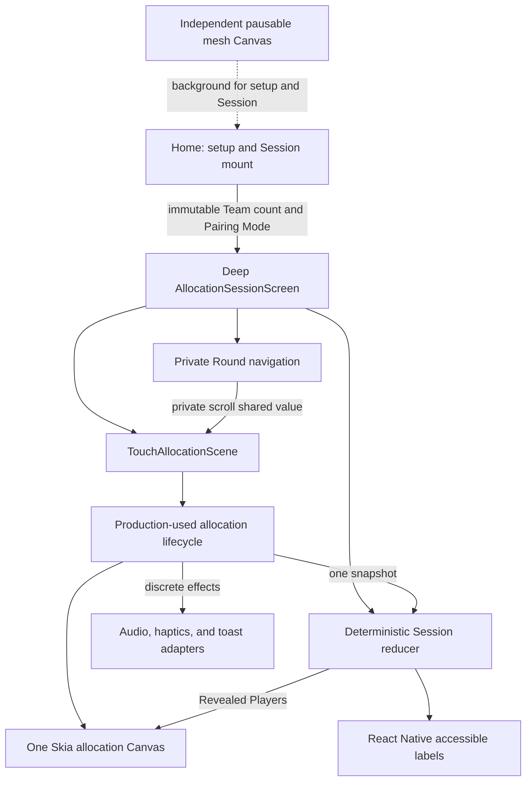

# Skia feedback implementation report

Status date: 18 August 2026
Implementation reviewed: `codex/deep-allocation-session` at `29a6fbb`

This report updates the earlier comparison made at `a577ef8`. It reconciles
three inputs against the implementation after the unified scene and deep
Session work:

1. [Shopify's React Native Skia repository and examples](https://github.com/Shopify/react-native-skia/tree/main)
2. [The Medium article, “Using React Native Skia to Build More Than Just SVGs”](https://medium.com/@silverskytechnology/using-react-native-skia-to-build-more-than-just-svgs-a5bc1d6022c5)
3. [The third-party Reanimated/Skia performance skill mirrored by LobeHub](https://lobehub.com/skills/neversight-skills_feed-reanimated-skia-performance)

The Shopify repository is the authoritative source for Skia APIs and
patterns. The article and skill are useful secondary guidance; their examples
and performance claims are not treated as library guarantees.

The tables preserve the three sections used by the original comparison; they
do not imply that every project decision was literally prescribed by that
source. See [`feedback-source-audit.md`](./feedback-source-audit.md) for the
complete direct source lists and the Direct/Adapted/Project-review provenance
of each earlier recommendation.

Legend:

- ✅ Implemented
- 🟡 Implemented in code, but validation or a limited follow-up remains
- ⏸ Intentionally deferred until profiling or a second game justifies it
- ↩ Rejected after a failed visual experiment
- ➖ Not applicable to the current allocation game

## Current architecture

`Home` is now 64 lines and owns setup plus Session mounting. The active game
is behind `AllocationSessionScreen`, whose public interface is only immutable
configuration plus `onExit`.

## Feedback 1: Shopify repository examples

| Recommendation from the original comparison                                             | Status | What is implemented now                                                                                                                                                                                                       | What is still possible                                                                                                               |
| --------------------------------------------------------------------------------------- | ------ | ----------------------------------------------------------------------------------------------------------------------------------------------------------------------------------------------------------------------------- | ------------------------------------------------------------------------------------------------------------------------------------ |
| Render live and frozen/revealed dots in one Canvas                                      | ✅     | All live slots and both Round snapshots share one allocation Canvas. The mesh remains a separate, independent background Canvas.                                                                                              | Keep the mesh separate unless profiling shows a concrete benefit from coupling it to the game scene.                                 |
| Keep inactive slots from doing unnecessary drawing                                      | ✅     | All 12 slot identities remain available, but expensive revealed artwork mounts only for slots with completed assignments. This also prevents the native Skia animated-variable budget from being exhausted by hidden artwork. | Recheck the recorder budget if future artwork adds many animated properties.                                                         |
| Share one animation clock                                                               | ✅     | One `useClock` value drives the live-dot shimmer scene.                                                                                                                                                                       | Nothing required.                                                                                                                    |
| Keep continuous values on the UI thread                                                 | ✅     | Position, visibility, scale, countdown, reveal progress, shake, and Round scrolling use shared values and worklets.                                                                                                           | Nothing required for the current game.                                                                                               |
| Send only semantic events to JavaScript                                                 | ✅     | JavaScript receives discrete count changes, reveal completion, swipe-hint crossing, navigation settlement, feedback, and exit readiness.                                                                                      | Physical-device tracing can confirm that no unexpected hot-path crossing was introduced by a platform update.                        |
| Remove per-frame scroll reducer dispatches                                              | ✅     | `roundScrollX` drives Skia transforms and opacity directly. Only the first hint threshold and final settlement cross to JavaScript.                                                                                           | Nothing required.                                                                                                                    |
| Build a deep, allocation-specific module                                                | ✅     | `AllocationSessionScreen` owns Player count, plans, Round snapshots, reset keys, touch state, controls, navigation, and safe exit. `Home` no longer knows slot or Round mechanics.                                            | Extract a shared game abstraction only after another game demonstrates the same stable interface.                                    |
| Separate lifecycle, gesture adapter, renderer, navigation, feedback, and semantic state | ✅     | Worklet-compatible lifecycle transitions are production-used; the Gesture Handler hook adapts native events; feedback scheduling, Round navigation, Canvas rendering, and Session state have separate seams.                  | The production hook is still substantial, but its decisions now cross the tested lifecycle/effect seam rather than a parallel model. |
| Keep reducers deterministic                                                             | ✅     | Multi-Round assignment planning is computed before dispatch with injected randomness. Replaying the same plan produces the same state; duplicate reveal/navigation actions are idempotent.                                    | Nothing required.                                                                                                                    |
| Preserve the existing allocation domain                                                 | ✅     | Team identities, Fair Allocation, injected randomness, and domain tests remain authoritative. `RevealedPlayer` is the final position-plus-Team domain result.                                                                 | Nothing required.                                                                                                                    |
| Add deterministic visual regression coverage                                            | ✅     | Playwright covers unrevealed, countdown, revealed, frozen, mid-scroll, both settled accessibility positions, duplicate-label absence, and one Canvas.                                                                         | Native snapshots can be expanded if platform-specific artwork regressions recur.                                                     |
| Test the real touch lifecycle rather than a parallel model                              | ✅     | Unit tests exercise the same admission, visibility, count policy, token, snapshot, cancel/reset, reveal-position freeze, and deferred-exit transitions used by production. Native fixtures cover repeated dynamic slots and the Android Multi-Round transition.            | The remaining assistive-technology and release-ordering matrix still requires manual validation.                                      |
| Use Atlas only for a measured repeated-sprite bottleneck                                | ⏸      | Atlas was not introduced for at most 12 live dots and five results.                                                                                                                                                           | Reconsider for a future object-heavy game or if profiling shows result artwork batching is a bottleneck.                             |
| Avoid a generic engine before game two                                                  | ✅     | The module remains allocation-specific, as recorded in ADR 0004.                                                                                                                                                              | Reassess only after a second game provides evidence for common rules.                                                                |
| Match the app to the current compatible Skia API                                        | ✅     | The app is pinned to the tested `@shopify/react-native-skia` `2.11.0` release and satisfies the installed React Native/Reanimated peers.                                                                                       | Recheck the latest compatible version, migrations, and native rendering during every future Skia upgrade.                            |

### Shopify conclusion

The combined upstream and architecture-review decisions are implemented: one
scene Canvas, shared UI-thread animation state, semantic crossings,
deterministic domain state, a deep Session boundary, and production-used
lifecycle tests. Atlas, path morphing, and high-bit-depth rendering remain
evidence-driven options, not missing architecture work.

## Feedback 2: Medium article

| Decision grouped under the Medium feedback in the original comparison       | Status | Current result or reason                                                                                                                                      |
| --------------------------------------------------------------------------- | ------ | ------------------------------------------------------------------------------------------------------------------------------------------------------------- |
| Treat Skia as a specialized renderer, not a replacement for React Native UI | ✅     | Skia renders game artwork. React Native renders controls, instructions, navigation, dialogs, and accessible text.                                             |
| Use a hybrid React Native/Skia screen                                       | ✅     | ADR 0003 records and the implementation enforces this boundary.                                                                                               |
| Consolidate the game scene into one Canvas                                  | ✅     | Live and frozen/revealed allocation artwork shares one Canvas; the independent mesh is intentionally separate.                                                |
| Keep rapidly changing positions and animation values in shared values       | ✅     | Touch position, scale, opacity, countdown, reveal, shake, and scroll state remain on the UI thread.                                                           |
| Transfer only semantic changes to JavaScript                                | ✅     | Count, reveal, hint, settled Round, feedback, and exit events are discrete crossings.                                                                         |
| Keep Session state in React/a reducer                                       | ✅     | Declared Player count, assignment plans, Round state, navigation semantics, and Revealed Players are reducer-owned.                                           |
| Keep state ownership explicit                                               | ✅     | ADR 0003, ADR 0004, and `allocation-architecture.md` document the React Native, Skia, shared-value, lifecycle, and reducer responsibilities.                  |
| Use a game loop only for genuine continuous simulation                      | ✅     | Player allocation is event-driven and has no continuous game loop.                                                                                            |
| Use `useFrameCallback` only for continuous work                             | ✅     | The continuously animated mesh uses a frame callback; allocation does not.                                                                                    |
| Pause continuous animation while inactive                                   | ✅     | The mesh pauses when the route or application is inactive and preserves accumulated active time.                                                              |
| Keep collision/per-frame simulation in a dedicated loop                     | ➖     | This game has no collision or continuous physics.                                                                                                             |
| Avoid frame-rate-dependent physics                                          | ➖     | No physics was added, so the article's fixed-per-frame gravity pattern was not copied.                                                                        |
| Use elapsed/fixed time for a future physics game                            | ⏸      | This remains a requirement for a future game with simulation.                                                                                                 |
| Use sprite batching when there are many repeated objects                    | ⏸      | The article demonstrates transform-buffer batching; the current object count does not justify an Atlas-style batching implementation without profiling.       |
| Use shaders for visual polish, not game rules or ordinary UI                | ✅     | No shader controls game rules or replaces ordinary UI.                                                                                                        |
| Do not copy the article's shader snippet blindly                            | ✅     | The malformed/inconsistent educational shader sample was not used.                                                                                            |
| Preserve accessibility outside Skia                                         | ✅     | Localized React Native result labels expose only the current settled Round; decorative/off-screen layers are hidden from assistive technology.                |
| Add visual and interaction regression tests                                 | 🟡     | Deterministic visual, production-seam lifecycle, navigation, iOS repeated-ring, and Android Multi-Round rendering tests exist. Targeted physical iPhone and Huawei regressions passed; the full screen-reader matrix remains incomplete. |

### Medium conclusion

The article's principal lesson—the hybrid screen—is fully implemented. Its
physics and shader snippets remain educational examples rather than production
templates. The only incomplete item is physical interaction/accessibility
evidence, not the ownership model.

## Feedback 3: third-party performance skill mirrored by LobeHub

| Recommendation from the original comparison                   | Status | What is implemented now                                                                                                                                            | What remains or why it was not used                                                                  |
| ------------------------------------------------------------- | ------ | ------------------------------------------------------------------------------------------------------------------------------------------------------------------ | ---------------------------------------------------------------------------------------------------- |
| Remove scroll-to-JavaScript hot-path crossings                | ✅     | Continuous scrolling remains on the UI thread; only threshold and settlement events cross.                                                                         | Nothing required.                                                                                    |
| Keep gesture updates on the UI thread                         | ✅     | Manual gesture callbacks mutate worklet-owned lifecycle/shared state.                                                                                              | Nothing required.                                                                                    |
| Preserve the Android pointer lifecycle                        | 🟡     | The detector remains mounted; only new admissions are gated; up/cancel always clean up; Back waits for all tracked pointers. Targeted physical Huawei Multi-Round touch delivery passed.              | Complete three-plus-pointer release ordering and Back-during-tracking checks on a physical Android device. |
| Prefer transforms to animated layout properties               | ✅     | Allocation dots use Skia transforms instead of animated `left`, `top`, `width`, and `height`.                                                                      | Unrelated showcase/layout animations were outside scope.                                             |
| Consolidate live and frozen dots                              | ✅     | One allocation Canvas owns both. Hidden revealed artwork is no longer mounted for inactive slots.                                                                  | Nothing required.                                                                                    |
| Build one reveal snapshot on the UI thread                    | ✅     | Countdown completion creates one ordered `{slotIndex, touchId, x, y}[]` snapshot and crosses once.                                                                 | Nothing required.                                                                                    |
| Allocate Teams in semantic JavaScript/domain code             | ✅     | Fair Allocation remains in the domain layer rather than a rendering worklet.                                                                                       | Nothing required.                                                                                    |
| Apply assignments atomically on the UI thread                 | ✅     | One scheduled UI worklet clears and applies all Team/progress cells before emitting the semantic reveal.                                                           | Nothing required.                                                                                    |
| Avoid repeated JavaScript reads of shared values              | ✅     | Reveal no longer loops over shared cells from JavaScript.                                                                                                          | Nothing required.                                                                                    |
| Keep audio, haptic, and toast crossings discrete              | ✅     | They remain semantic feedback effects outside continuous transitions.                                                                                              | Nothing required.                                                                                    |
| Memoize stable artwork geometry                               | ✅     | Team paths and geometry are memoized/static; live progress paths are memoized.                                                                                     | Further geometry cleanup is visual polish, not a performance requirement.                            |
| Keep ordinary UI out of Skia                                  | ✅     | Controls and accessible semantics remain React Native.                                                                                                             | Nothing required.                                                                                    |
| Use `usePointBuffer` for the mesh                             | ↩      | A 2.11 buffer-backed `Vertices` experiment produced no visible mesh on tested builds, so the supported `Point[]` path was restored.                                | Revisit only when the documented `Vertices` integration accepts and visibly renders the buffer path. |
| Use `useColorBuffer` and eliminate per-frame color allocation | ↩      | The same experiment failed visually. The current supported path recreates application-side color arrays and strings; documentation makes no zero-allocation claim. | A lower-level or newly supported API would be required to meet literal zero allocation.              |
| Pause the mesh clock when unfocused/inactive                  | ✅     | A pausable frame callback preserves active elapsed time and stops inactive work.                                                                                   | Nothing required.                                                                                    |
| Measure full-screen blur separately                           | 🟡     | A production-disabled native fixture provides current-blur, identical no-blur, and paused scenarios.                                                               | Record Instruments and `dumpsys gfxinfo` evidence on real iOS and Android devices.                   |
| Reduce blur/frequency on weaker devices                       | ⏸      | No appearance-changing adaptive policy was introduced without measurements.                                                                                        | Decide only after representative device profiling.                                                   |
| Standardize `.get()`/`.set()` for React Compiler              | ✅     | Allocation Session, navigation, lifecycle/controller, scene, feedback, and mesh modules use the accessors where supported.                                         | Repository-wide migration remains intentionally deferred.                                            |
| Optimize smaller unrelated layout animations                  | ⏸      | Toast, checkbox, and showcase animation cleanup was outside the allocation initiative.                                                                             | Address when those modules are profiled or changed.                                                  |
| Add a development tuning panel                                | ⏸      | No interactive tuning UI was added. Fixed visual and mesh fixtures provide deterministic evidence instead.                                                         | Add only when active art-direction/performance tuning justifies permanent tooling.                   |
| Avoid per-frame allocations generally                         | 🟡     | Allocation interactions avoid per-frame JavaScript work. The supported mesh path still recreates application-side points/colors each frame.                        | Mesh allocation is the main known exception and should be assessed with real-device evidence.        |
| Profile before claiming 60/120 FPS                            | 🟡     | No device-specific FPS threshold or unsupported performance claim was added. Benchmark routes and protocols exist.                                                 | Physical measurements remain pending.                                                                |

### Third-party skill conclusion

The important interaction recommendations are implemented: UI-thread gestures,
transform-based artwork, one snapshot, atomic assignment, discrete feedback,
mesh pausing, and scoped compiler-compatible access. The buffer recommendation
was tested rather than accepted on faith and was rejected because it broke the
mesh. The remaining performance work is measurement, not speculative tuning.

## Cross-feedback summary

| Shared theme                                 | Overall status                                    |
| -------------------------------------------- | ------------------------------------------------- |
| Hybrid React Native + Skia boundary          | ✅ Implemented                                    |
| One allocation Canvas                        | ✅ Implemented                                    |
| UI-thread continuous state                   | ✅ Implemented                                    |
| Semantic JavaScript crossings                | ✅ Implemented                                    |
| Deterministic Session/domain state           | ✅ Implemented                                    |
| Deep allocation-specific Session             | ✅ Implemented                                    |
| Production-used lifecycle tests              | ✅ Implemented                                    |
| Transform-based positioning                  | ✅ Implemented                                    |
| Single reveal snapshot                       | ✅ Implemented                                    |
| Atomic UI-thread assignment                  | ✅ Implemented                                    |
| Accessible visible-only result labels        | ✅ Implemented in code and automated web checks   |
| Pausable mesh animation                      | ✅ Implemented                                    |
| Native repeated-dot rendering regression     | ✅ iOS dynamic-slot and Android Multi-Round fixtures |
| Revealed positions remain frozen             | ✅ Unit-tested and confirmed on physical iPhone 17 |
| Android second-Round rendering               | ✅ Confirmed on physical Huawei EML-L29            |
| Physical multitouch and screen-reader matrix | 🟡 Targeted regressions passed; full matrix pending |
| Native mesh/blur measurements                | 🟡 Fixture ready; evidence pending                |
| Zero-allocation mesh                         | ↩ Not achieved; failed buffer experiment reverted |
| Repository-wide shared-value migration       | ⏸ Intentionally deferred                          |
| Atlas, shaders, path morphing, physics       | ⏸ Intentionally deferred                          |
| Generic reusable game engine                 | ⏸ Intentionally deferred                          |
| Adaptive quality and tuning controls         | ⏸ Intentionally deferred                          |

## What was added beyond the original feedback

- A pointer-safe exit handshake prevents Session unmount while native pointers
  are still tracked.
- Round offset, arrows, pagination, threshold detection, reset, settlement, and
  input gating are private to the Session.
- The native regression command now opens the real production-disabled fixture,
  verifies that the fixture loaded, and checks two dynamically activated rings.
- Revealed artwork mounts only for assigned slots. This fixed the native Skia
  recorder-capacity bug that caused only the first unrevealed ring to appear.
- Revealed Player positions stop responding to move/admit transitions while
  native pointer ownership remains intact until up/cancel. This prevents
  translucent artwork from moving after reveal without weakening Android
  cleanup guarantees.
- Android pre-renders the five immutable Team results as non-texture Skia
  images before animating frozen-Round opacity or translation. This avoids an
  old-Mali/EGL failure that hid second-Round live dots while keeping the
  original vector path on iOS and web.
- A deterministic Android fixture reproduces the five-result first Round plus
  two dynamic second-Round rings and checks frozen counts one through five.
- ADR 0004 and a durable architecture document replace reliance on temporary
  HTML reports.

## Remaining improvements, in priority order

1. Complete the portions of the physical iPhone and Android matrix not already
   covered by the targeted regression checks: cancellation, Back during
   tracking, audio/haptics, VoiceOver/TalkBack, and Android three-pointer
   release ordering.
2. Record the three mesh scenarios on representative real devices and decide
   whether full-screen blur needs a measured policy.
3. Watch the allocation Canvas's animated-variable budget when adding artwork;
   keep expensive nodes conditional and add a five-result native regression if
   the revealed design grows.
4. Reconsider Atlas or another batching strategy only after profiling or a
   future game introduces substantially more repeated artwork.
5. Reconsider a generic game engine only after a second game proves a stable
   common lifecycle. Keep the current allocation module deep and specific.

## Verification evidence

- TypeScript passed.
- Localization checks passed.
- 219 unit tests passed.
- Seven Playwright checks passed.
- Lint reported no errors and six pre-existing unrelated warnings.
- The corrected native two-ring fixture passed on the iPhone 17 simulator.
- The Android Multi-Round fixture passed with one through five frozen results,
  detecting both second-Round rings in every scenario.
- The reveal-position freeze passed on a physical iPhone 17, and the real `+5`
  second-Round flow passed on a Huawei EML-L29 running Android 10.
- iOS and Android Release builds completed during the plan implementation.
- Physical performance, VoiceOver/TalkBack, Back-during-tracking, and complete
  Android release-ordering evidence remains pending as documented in
  `touch-allocation-validation.md`.
